# AGH Drone Engineering - strona internetowa

Strona wykonana jest jako headless wordpress website - frontend napisany w next.js wykorzystuje instancję Wordpressa jako backend (źródło danych o istniejących stronach, ich layoucie, treści itd).

## Taskboard
Wszystkie taski związane z developmentem strony rozpisane są na [trello](https://trello.com/b/bo5cyiZ0/strona-internetowa-%F0%9F%9A%80).

## Setup środowiska developerskiego
### Wymagane oprogramowanie
* Node wersja >= 18 (do instalacji imo najwygodniej użyć [nvm](https://github.com/coreybutler/nvm-windows#installation--upgrades))
* [Docker desktop](https://docs.docker.com/desktop/install/windows-install/)
* Jakiś edytor/IDE (preferowany: [vscode](https://code.visualstudio.com/download))
* [PowerShell 7](https://learn.microsoft.com/en-us/powershell/scripting/install/installing-powershell-on-windows?view=powershell-7.3)
* Oczywiście [git](https://git-scm.com/download/win)

### Krok po kroku
1. **Git clone**
   Klonujemy repo do dowolnie wybranego folderu na komputerze
   ```bash
    git clone https://github.com/AGH-Drone-Engineering/website <scieżka do wybranego folderu docelowego>
   ```
   Wszystkie komendy from now on wykonywane są w folderze do którego sklonowane zostało repo (lub w jego podfolderach, gdy tak jest napisane)

2. **Uzupełnienie plików konfiguracyjnych**
   * Skopiuj plik `.env.example` i zmień nazwę kopii na `.env`
     ```bash
     cp .env.example .env
     ```
   * W utworzonym pliku uzupełnij wartości zmiennych zgodnie z komentarzami. Zawartych tam haseł nie będzie trzeba podawać nigdzie indziej (jeżeli nie będziemy mieli potrzeby wykonywania operacji bezpośrednio na bazie danych, ale raczej nie będzie takej potrzeby), także najlepiej żeby były po prostu losowymi ciągami znaków.
   Zmienne z przedrostkiem `WP_` generujemy na [stronie](https://roots.io/salts.html) podanej w komentarzu w pliku. Interesuje nas tylko sekcja `Env Format`. Po skopiowaniu całego bloku zmiennych ze strony należy pamiętać o ponownym dodaniu przedrostka `WP_` do nazwy każdej ze skopiowanych zmiennych.
   * Wykonaj tą samą procedurę dla pliku `.env.example` znajdującego się w folderze `frontend`. Tam jednak po skopiowaniu pliku nie trzeba nic robić, ponieważ wszystkie wymagane wartości są już wpisane w plik `.env.example`

3. **Instalacja bibliotek**
   * W folderze `frontend` uruchom komendę
        ```bash
        npm install
        ```
   * W folderze `wordpress` uruchom komendę
      ```ps1
      .\composer install
      ```
      **Ważne:** nie należy pomijać `.\` na początku komendy (ma się wykonać lokalny skrypt obecny w folderze `wordpress`)

4. **Uruchomienie lokalnego środowiska na dockerze**
   ```bash
   docker compose up -d --build
   ```
   Uruchomione w ten sposób kontenery będą automatycznie restartowane oraz uruchamiane wraz z uruchomieniem programu `Docker desktop`, więc nie trzeba właściwie się już nimi w ogóle przejmować. Jeżeli potrzeba je z jakiegoś powodu zatrzymać, to używa się do tego komendy `docker compose down` (Musi być uruchomiona w folderze z repo).

   Po udanym uruchomieniu kontenerów dostępne staną się:
   * **Lokalna instancja wordpressa** - pod adresem http://localhost:8000/wp/wp-admin/ (wpisanie samego adresu bez ścieżki spowoduje błąd). Po pierwszym uruchomieniu instancji będzie ona już zainicjalizowana. Jest na niej jeden użytkownik administracyjny. Jego dane do logowania to username: `mafciej`, password: `:W7jcD;"-g?@PSf}m"/_>m/j>c^:^Et7`. Po zalogowaniu można sobie stworzyć swojego użytkownika i korzystać później z niego, albo używać domyślnego, nie ma różnicy.
   * **Aplikacja do zarządzania lokalną bazą danych, z której korzysta wordpress** - pod adresem http://localhost:8080/. Aby zalogować się do bazy używamy wartości zmiennych `DB_USER` i `DB_USER_PASSWORD` z pliku `.env`

5. **Uruchomienie aplikacji frontendowej**
   W folderze `frontend` uruchamiamy komendę
   ```bash
   npm run dev
   ```
   Jeżeli wszystko pójdzie dobrze, to apkę będzie dostępna na localhoscie na porcie 3000 (http://localhost:3000). Wszystkie zmiany w plikach apki powinny być automatycznie widoczne w przeglądarce, bez potrzeby manualnego odświeżania strony (ale czasem gdy coś nie działa tak jakbyśmy się spodziewali to warto jednak spóbować odświeżyć ręcznie).

   **Troubleshooting - znane problemy**
   Czasem po uruchomieniu komendy `npm run dev` zobaczymy coś takiego:
    ```
    [gql-types] [STARTED] Parse Configuration
    [gql-types] [SUCCESS] Parse Configuration
    [gql-types] [STARTED] Generate outputs
    [gql-types] [STARTED] Generate to ./models/graphql.generated.ts
    [gql-types] [STARTED] Load GraphQL schemas
    [gql-types] [SUCCESS] Load GraphQL schemas
    [gql-types] [STARTED] Load GraphQL documents
    [gql-types] [SUCCESS] Load GraphQL documents
    [gql-types] [STARTED] Generate
    [gql-types] [FAILED]
    [gql-types] [FAILED]         Unable to find template plugin matching 'typescript'
    [gql-types] [FAILED]         Install one of the following packages:
    [gql-types] [FAILED]
    [gql-types] [FAILED]
    [gql-types] [FAILED]         - @graphql-codegen/typescript
    [gql-types] [FAILED]         - @graphql-codegen/typescript-template
    [gql-types] [FAILED]         - @graphql-codegen/typescript-plugin
    [gql-types] [FAILED]         - graphql-codegen-typescript
    [gql-types] [FAILED]         - graphql-codegen-typescript-template
    [gql-types] [FAILED]         - graphql-codegen-typescript-plugin
    [gql-types] [FAILED]         - codegen-typescript
    [gql-types] [FAILED]         - codegen-typescript-template
    [gql-types] [FAILED]         - typescript
    [gql-types] [FAILED]
    [gql-types] [SUCCESS] Generate outputs
    [gql-types] npm run generate:gql-types exited with code 1
    ```
    Jednym z potencjalnych rozwiązań tego problemu jest uruchomienie następującej komendy:
    ```bash
    npm install --location=global @graphql-codegen/typescript
    ```
    i spróbowanie ponownego uruchomienia aplikacji. Jeżeli to nie pomoże, to nie wiem co xD. Jest to problem którego definitywnego rozwiązania jeszcze nie znalazłem, ciężko to idzie ogółem.

## Development

### Dodawanie nowego bloczku
1. Upewniamy się że mamy zainstalowane w vscode rozszerzenie "File template manager":
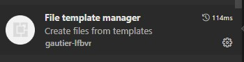
1. Tworzymy nowy podfolder w folderze `Custom blocks/src/blocks`
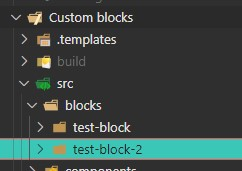
1. Uzupełniamy folder plikami za pomocą rozszerzenia do templatek
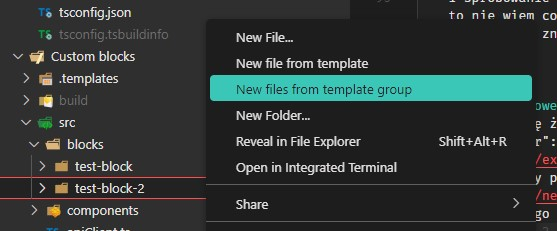
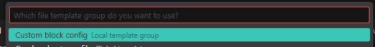
Po zakończeniu działania rozszerzenia folder powinien wyglądać następująco
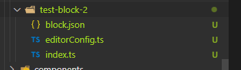

1. Uzupełniamy wymagane przez blok atrybuty - edytor powinien sam podpowiadać odpowiednie pola
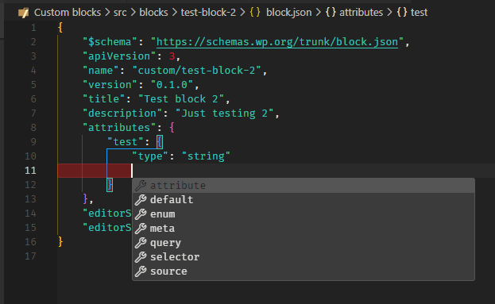
1. Jeżeli atrybuty komponentu wymagają dodatkowej konfiguracji interfejsu edytorskiego, dodajemy ją w pliku `editorConfig.ts`
   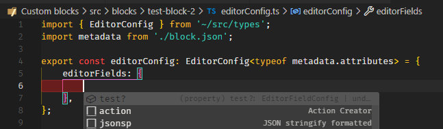
   Np tak
   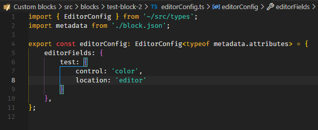
2. W projekcie "Custom blocks" uruchamiamy komendę `npm start` (lub `npm run build` jeżeli chcemy tylko raz zbudować bloczki i nie planujemy w nich dłużej grzebać). Powinna ona wyprodukować coś co wygląda podobnie do poniższego screenshota
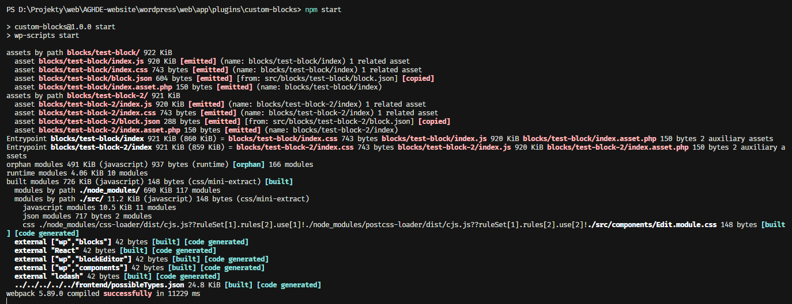

1. Przechodzimy do projektu "Frontend"
2. Tworzymy nowy podfolder w `blocks/custom`
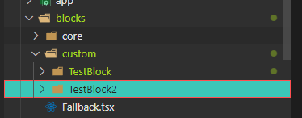
1. Uzupełniamy go templatką podobnie jak w punkcie 3, wybierając grupę "Custom block"
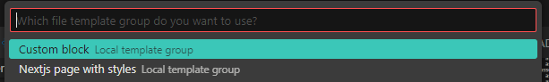
Po wygenerowaniu plików plik z komponentem powinien wyglądać mniej wiecej tak
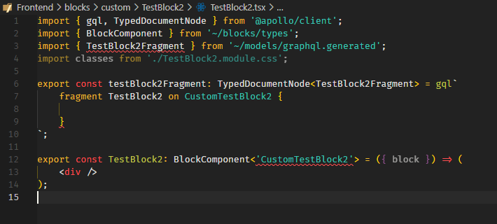
1. W nowo wygenerowanym pliku z komponentem uzupełniamy query fragment komponentu o skonfigurowane wcześniej w pliku `block.json` atrybuty (IDE samo powinno je podpowiedzieć, ew może być wymagany restart rozszerzenia do graphql aby odświeżyć schema)
   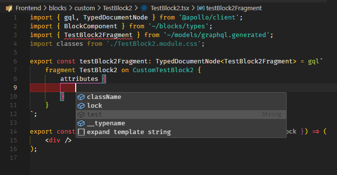
1. Stworzony komponent dopisać do pliku `blocks/index.ts` pod kluczem `Custom<NazwaBloku>`
   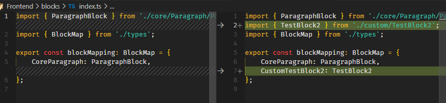
1. Zmienną z fragmentem dopisać do query w pliku `api/queries/getEditorBlocks.ts` w następujący sposób:
   
   Na górze dodajemy nazwę zmiennej zawierającej fragment, a na dole nazwę tego fragmentu
2. W folderze Frontend uruchamiamy komendę `npm run predev` aby wygenerować na nowo pliki z definicjami typów Graphqlowych. Powinna ona wyprodukować coś podobnego do tego
   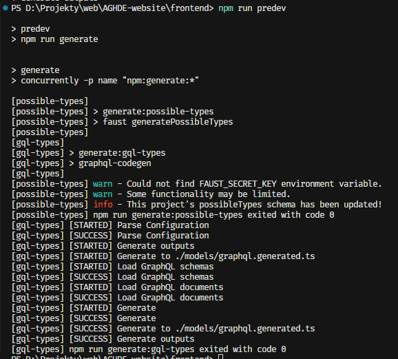
1. Teraz już możemy użyć atrybutów bloku w komponencie
   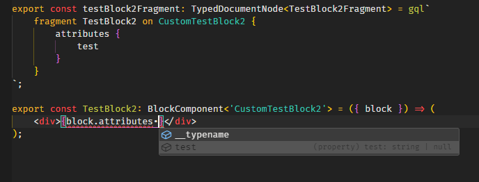
1. Na końcu uzupełniamy argumenty do story nowego bloczka
   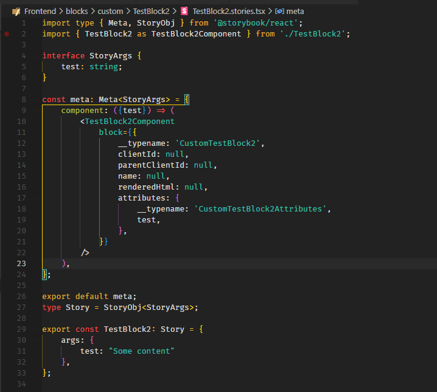
1. Aby przetestować wygląd nowego bloczka wchodzimy na jakąś stronę/post w edytorze wordpressowym, klikamy plusik i jeśli zrobiliśmy wszystko poprawnie to powinniśmy być w stanie znaleźć tutaj nasz nowy bloczek
   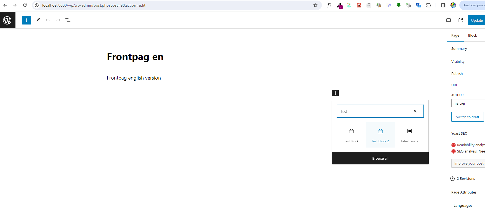
1. Pojawi się interfejs edytorski bloczka, stworzony na podstawie definicji atrybutów oraz konfiguracji z `editorConfig.ts`
   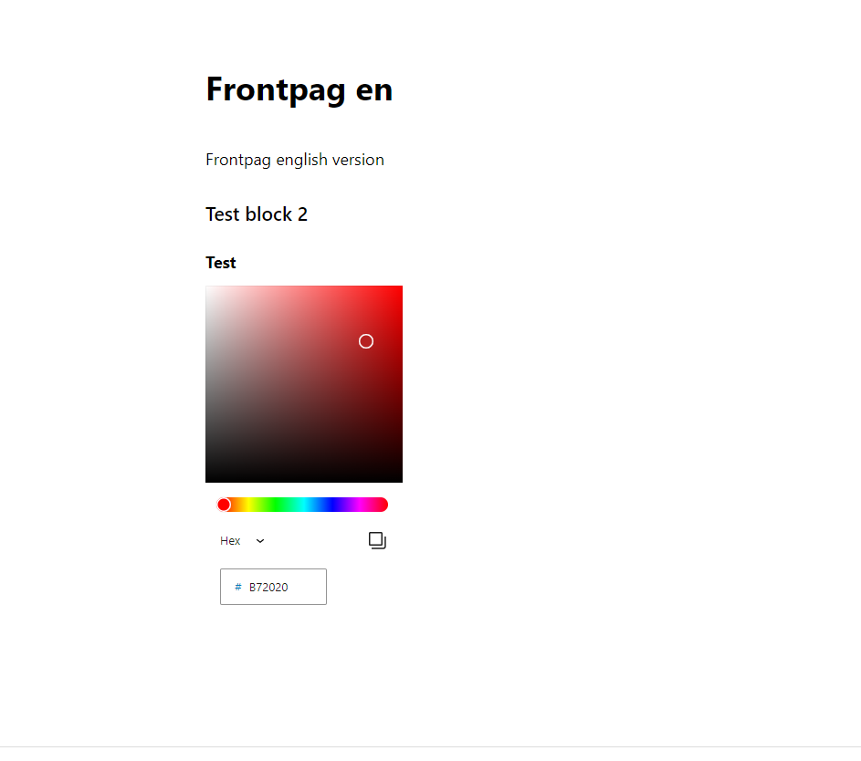
1. Klikamy "update" i przechodzimy do uruchomionego projektu frontendowego, odpalamy w nim stronę na której dodaliśmy bloczek i oglądamy nasz nowy bloczek
   
